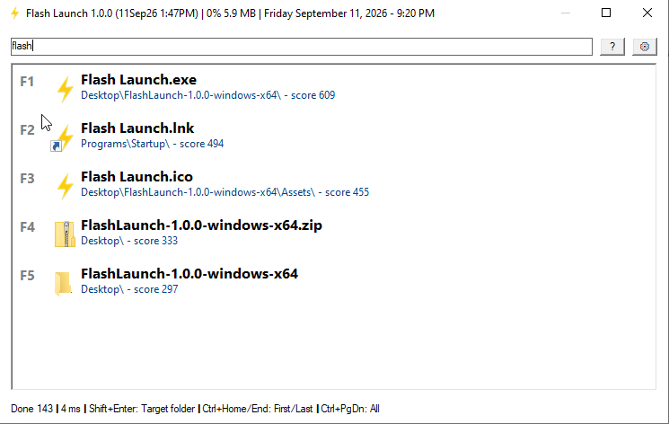
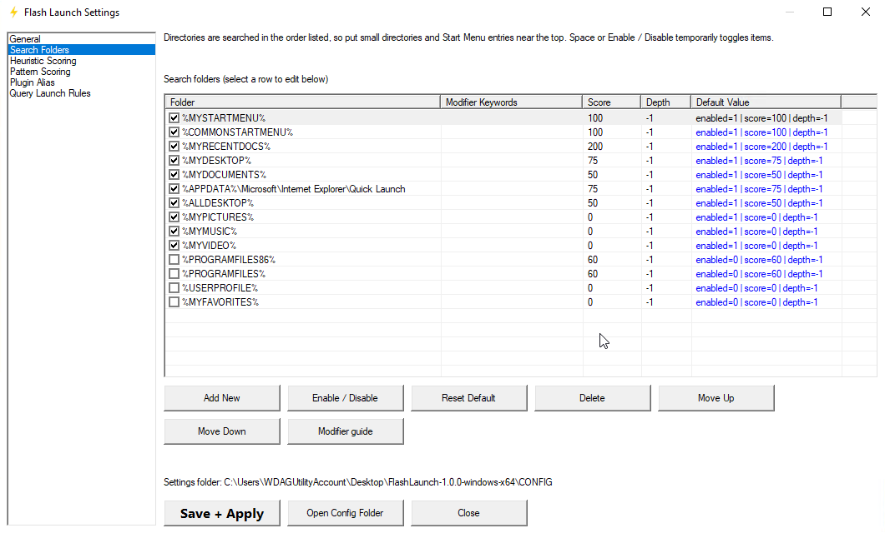
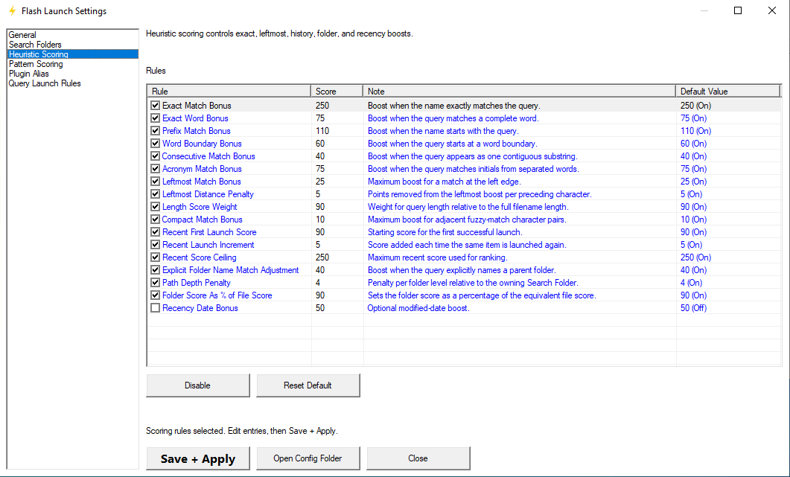
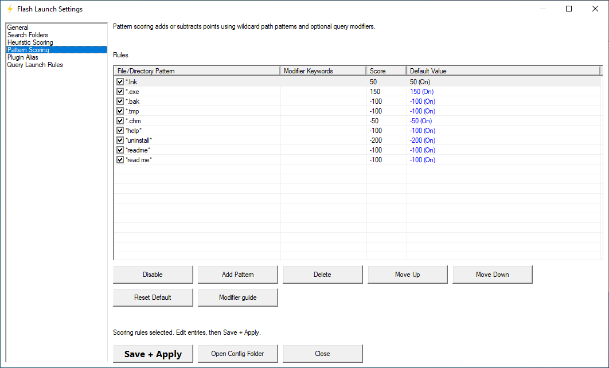

## Download and run

1. Open the [latest release](https://github.com/SingCJ/FlashLaunch/releases/latest) and download the archive for your Windows architecture:
   - 64-bit Windows: `FlashLaunch-<version>-windows-x64.zip`
   - 32-bit Windows: `FlashLaunch-<version>-windows-x86.zip`
2. Extract the entire archive into a writable folder. Keep `Languages` and `Assets` beside `Flash Launch.exe`.
3. Run `Flash Launch.exe`.
4. Press **Pause** to show or hide the launcher. You can change this shortcut in Settings.
5. Type a name, select a result, and press **Enter** to launch it.

The release is for Windows. No Rust or Python installation is required to run it. The executable is not code-signed; Windows may display a security warning. Only run downloads from a source you trust.

Open Settings from the notification-area icon to configure search folders, language, hotkey, and ranking. Click **Save + Apply** to save changes. If your keyboard has no Pause key, use the notification-area icon to open Settings and choose another shortcut.

## Screenshots

  
  
  
  

# Flash Launch

A lightweight, keyboard-first application launcher for Windows, built with Rust and the native Windows API.

## Why I made this

I like **FARR (Find and Run Robot)**, but its lack of Unicode support gets in the way of my workflow. I built Flash Launch as a replacement that can handle Unicode application names, filenames, and paths.

The main goal is simple: **use little system resources and launch things quickly**. Flash Launch focuses on a small native application and responsive, on-demand searching rather than a heavyweight interface. These are design goals, not claims of benchmark superiority over other launchers.

## Features

- Search and launch applications, files, and folders with Unicode names.
- Global keyboard shortcut and a compact results popup.
- Case-insensitive, accent-insensitive search with fuzzy matching.
- Configurable search folders, directory depth, and query modifiers.
- Adjustable ranking rules and a detailed score breakdown.
- Recent launch history and learned query-to-result preferences.
- Built-in calculator, path aliases, and Windows context-menu actions.
- Native interface without a bundled browser runtime.
- Portable configuration stored next to the executable.

## Languages

English is built in. Additional language packs are included:

| Language | Pack |
| --- | --- |
| Czech | `cs.ini` |
| German | `de.ini` |
| Spanish | `es.ini` |
| French | `fr.ini` |
| Indonesian | `id.ini` |
| Italian | `it.ini` |
| Japanese | `ja.ini` |
| Korean | `ko.ini` |
| Dutch | `nl.ini` |
| Polish | `pl.ini` |
| Brazilian Portuguese | `pt-BR.ini` |
| Russian | `ru.ini` |
| Thai | `th.ini` |
| Turkish | `tr.ini` |
| Ukrainian | `uk.ini` |
| Vietnamese | `vi.ini` |
| Simplified Chinese | `zh-CN.ini` |
| Traditional Chinese | `zh-TW.ini` |

Select a language in Settings and click **Save + Apply**. Language files are loaded from `Languages` when the app starts; restart after adding or editing a pack. Missing translations fall back to English.

The language packs started as machine-assisted translations and have not been fully reviewed by native speakers. Corrections are welcome. Translation services are not used by the application at runtime.

To contribute a language, copy an existing `.ini` file, set a unique `id` and native `name`, and translate the values only. Keep English keys, placeholders such as `{}` and `{weekday}`, escaped line breaks, paths, and command syntax intact. Save the file as UTF-8.

## Local data

Settings and launch history are kept in `CONFIG` beside the executable. Language packs are in `Languages`. The application resources are in `Assets` (`Flash Launch.ico`, `Flash Launch.png`, and `fping.wav`); diagnostic and temporary files may also be created within the application folder. Use a writable location rather than a protected system directory.

Release archives contain the executable and every file in the `Assets` and `Languages` folders. They do not include the author's settings, search folders, launch history, or crash logs. Back up your own `CONFIG` folder before replacing an existing installation.
